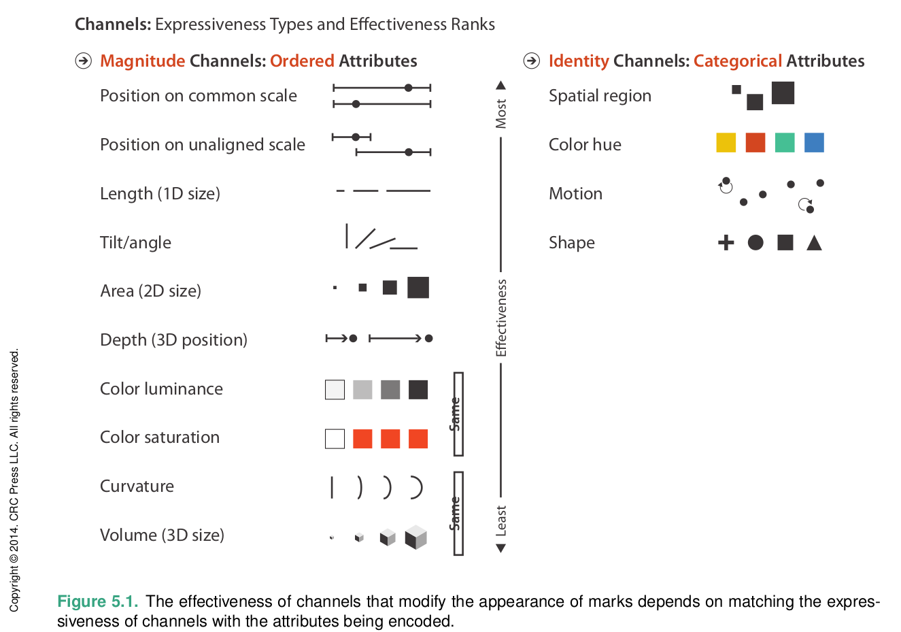

A lot of research has gone into how we read visual encodings. This is a good summary from @munzner2014, which you can read in full through UMBC's library. There are also very thorough [slides](https://dl.acm.org/action/downloadSupplement?doi=10.1145%2F3721241.3733989&file=longcourse-sig25.pdf) online from a course she taught on the same topics (this is on page 59).

