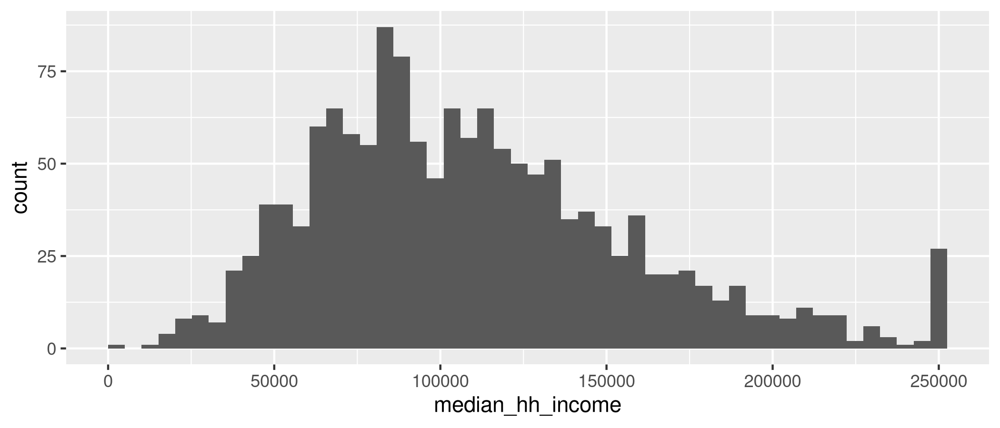

When you render a quarto or RMarkdown notebook to markdown or html (probably some other formats as well), any plots you generated in your code will get written into a folder with generic names based on the chunk labels. You then have an image file saved locally, but because its name and dimensions are tied to parameters you set in the chunk that creates them, it's not a very sustainable way to save a plot.

It's better to export your plots intentionally. `ggplot2::ggsave` makes this less of a pain. There are a lot of tricky arguments you can set (e.g. graphics devices), but a few basic arguments are all you need for this class.

The only trick with `ggsave` is that other functions take the plot first, but this takes the plot's filename first and the plot itself second. You actually don't need to supply the plot---if you leave that argument blank, it will just take the last plot that was displayed---but again, be intentional. Assign your final plot to a variable, then pass the filename and plot to `ggsave` like so:


```{r}
#| label: setup
#| warning: false 
library(ggplot2)

hist1 <- justviz::acs |>
    dplyr::filter(level == "tract") |>
    ggplot(aes(x = median_hh_income)) +
    geom_histogram(bins = 50)

hist1
```

::: {.aside}
You can assign a plot object to a variable the same way you would do with a number, a vector, a data frame, or anything else. It returns a special `ggplot` object; verify this by calling `class(hist1)`.
:::

Then save it. `ggsave` will assume the filetype you want from the extension in the filename. PNG is a good general-purpose filetype for images that works well. If I need to export plots in vector formats so they can be edited directly in outside graphic design software, I'll export one copy to PNG for easy viewing, and one copy to SVG or PDF to send to a graphic designer.

```{r}
#| label: ggsave
ggsave(
    here::here("extras/seaberry-median-income-hist.png"),
    hist1,
    # width & height in inches
    width = 7,
    height = 3,
    # if you don't set a background it'll be transparent
    bg = "white"
)
```

That gives me a PNG file that looks like this (I set different dimensions so you can tell this is the exported version, not just generated in the code):

