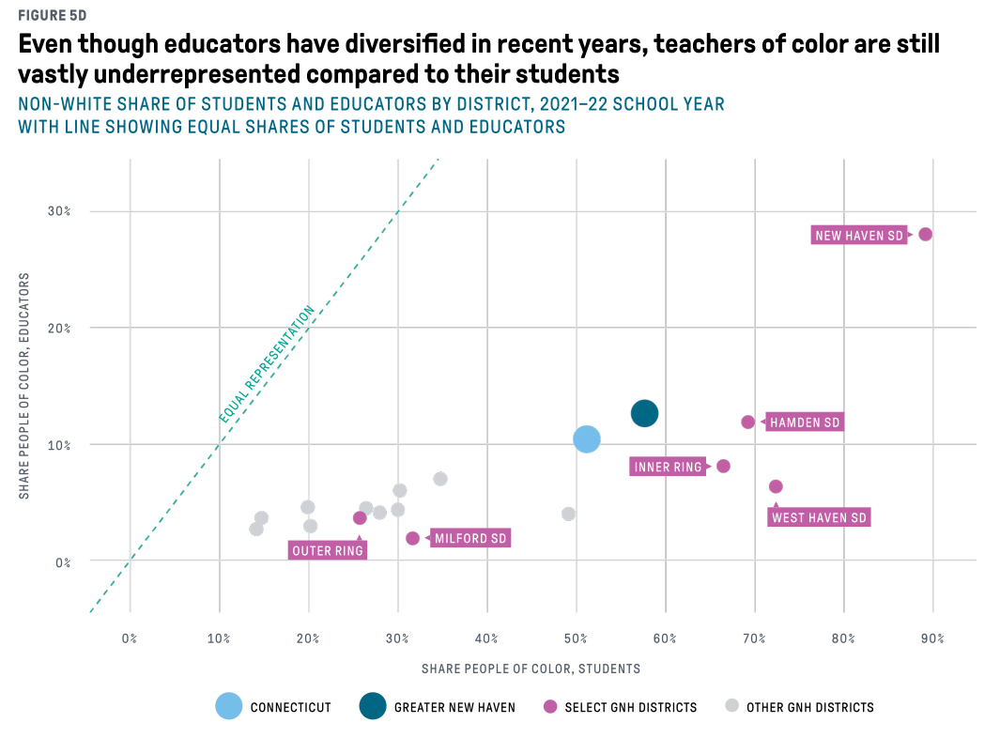
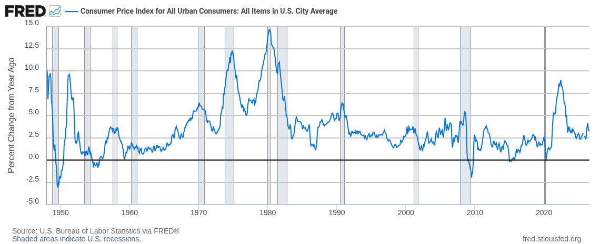
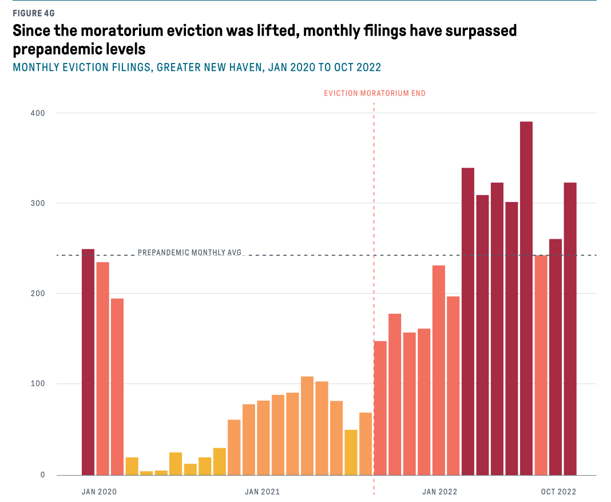

Originally annotations and text were supposed to be the same topic, but annotations require some data wrangling tasks that I want to dedicate some time to.

Annotations are basically the extras in your chart---they're not the data itself, at least not in its entirety, and the chart could exist without them. But good annotations enhance the message of the chart, and help your reader dig deeper into the data or understand it more thoroughly than they would without them.

Types of annotations in static visualization might be highlights, focus points, shaded areas, or callout boxes. These all direct your reader to a certain point or give them some context that you want to ensure they have.

## Annotations to direct attention

Sometimes you'll want to show all your data, but highlight specific observations, maybe outliers or a region or group your research is focused on. For example, here's the same old type of scatterplot we've seen of Maryland tracts, but this time I've highlighted Baltimore city. Let's say I'm studying housing costs, and want to see how renter cost burden rates compare to owner cost burden rates:

```{r}
#| label: setup
library(ggplot2)

theme_set(theme_minimal())
qual_pal <- rcartocolor::carto_pal(n = 5, name = "Bold")

md_tracts <- justviz::acs |>
    dplyr::filter(level == "tract", total_hh >= 100) |>
    # create a new variable for Balt city or nah
    dplyr::mutate(
        is_balt_city = ifelse(
            county == "Baltimore city",
            "Baltimore city tracts",
            "Other tracts"
        )
    ) |>
    # make it a factor with focus area first
    dplyr::mutate(
        is_balt_city = as.factor(is_balt_city) |>
            forcats::fct_relevel("Baltimore city tracts")
    ) |>
    # get the other columns out of the way
    dplyr::select(
        name,
        county,
        is_balt_city,
        total_hh,
        median_hh_income,
        homeownership,
        total_severe_cost_burden,
        owner_severe_cost_burden,
        renter_severe_cost_burden,
        total_vacant_units
    )

head(md_tracts)
```

```{r}
#| label: scatter-hilite
cost_scatter <- md_tracts |>
    # not really useful to compare renters & owners if there are no owners or no renters
    dplyr::filter(homeownership > 0 & homeownership < 1) |>
    ggplot(aes(
        x = renter_severe_cost_burden,
        y = owner_severe_cost_burden,
        color = is_balt_city
    )) +
    geom_point(alpha = 0.7) +
    # use a named vector to force colors attached to the levels you want
    scale_color_manual(
        values = c(
            "Baltimore city tracts" = "mediumorchid",
            "Other tracts" = "gray70"
        )
    ) +
    scale_x_continuous(breaks = seq(0, 1, by = 0.2))

cost_scatter
```

::: {.aside}
You can assign a ggplot object to a variable just like any other data type, and then add on to it later
:::

On its own, this isn't particularly interesting, just a big blob of points, with points for Baltimore scattered all over. But notice how different the ranges of data are, which you can see by how different their scales are. We can fix those to be equal.

```{r}
#| label: scatter-axes
cost_scatter +
    coord_equal()
```

There still isn't a clear pattern in the data, but that's sometimes the interesting thing you'll help your reader find. If affording housing were equally difficult or easy for renters and owners, we'd see a 1-to-1 relationship. You can annotate the data to highlight the _lack_ of such a relationship:

```{r}
#| label: scatter-line
cost_scatter +
    # abline as in y = ax + b
    geom_abline(intercept = 0, slope = 1, color = "gray40") +
    coord_equal() +
    labs(
        title = "Severe cost burden rate for owner households vs renter households,\nMaryland tracts, 2024",
        subtitle = "With parity line shown"
    )
```

(Depending on your audience you probably want better wording than "parity." "Equal rates..."?)

What would you highlight instead if you were presenting to a group doing housing cost support for first-time homeowners, or in rural areas, or for renters in places that are mostly homeowners?

Here's a similar chart I designed (this was then cleaned up by our graphic designers) where I used annotations to show the pattern we might naively expect, and the pattern we actually see:



## Annotations to provide contextual information

If you're showing data over time, you might want to show a specific historic period, even if it isn't directly part of your data. FRED (Federal Reserve Bank of St. Louis's data platform) churns out very boring, very consistent and readable trend plots of economic data. They almost always have the same annotations:



You'll have access to their recession definitions data (fun!) for the lab.

You might also want to show how your data compares to some threshold, like an average from before the focus period of your chart, or a national or state average. For example, if you're looking at a distribution that neatly fits a normal curve, you can ballpark where the mean and/or median are; that's harder when the data is skewed.

```{r}
#| label: cost-md-compare
md_avg <- justviz::acs |>
    dplyr::filter(level == "state")

ggplot(md_tracts, aes(x = renter_severe_cost_burden)) +
    # different geoms can get their own data---useful for filtering on the fly as well
    geom_histogram(binwidth = 0.025, fill = "gray60", color = "white") +
    # vline for vertical line
    geom_vline(
        aes(xintercept = renter_severe_cost_burden),
        data = md_avg,
        linetype = "dashed"
    ) +
    labs(
        title = "Distribution of renter severe cost burden rate, Maryland tracts, 2024",
        subtitle = "With statewide rate shown as dashed line"
    )
```

(We'll revisit this one when we work on text next week.)

In the same book as the scatterplot above, we also ran this chart of eviction rates before, during, and after covid-related policies. It was fine without annotations, but the story became much more clear when we added lines for both the prepandemic average and the end of the federal eviction moratorium. 



Similar to the FRED charts, you might have an area of the chart you want to fill in to say "hey, something happened here!" For example, there are no measurements in the unemployment trend that explicitly say covid, but we can tell immediately looking at it when lockdown started. Use `geom_rect` to fill in a bounded area. In this case, I'll highlight the period during which PPP loans were issued (April 3, 2020 to May 31, 2021).

Some geoms can take positive or negative infinity as positions; this will be interpreted as the absolute upper or lower bounds of the chart. In this case, regardless of the actual unemployment values, I want the shaded area to go from the very top of the chart to the very bottom, and then I'll set the x limits.

```{r}
#| label: area-fill
# make a lil data frame of dates
ppp <- data.frame(start = as.Date("2020-04-03"), end = as.Date("2021-05-31"))

ppp

# ggplot draws layers in order, so for rect to be in background, draw it first
justviz::unemployment |>
    dplyr::filter(name == "Maryland", lubridate::year(date) >= 2019) |>
    ggplot(aes(x = date, y = rate)) +
    # note the different args for rect
    # because this data doesn't have date & rate variables, override the aes with inherit.aes arg
    geom_rect(
        aes(xmin = start, xmax = end, ymin = -Inf, ymax = Inf),
        data = ppp,
        inherit.aes = FALSE,
        alpha = 0.3,
        fill = qual_pal[2]
    ) +
    geom_line()
```


## Note: `ggplot2::annotate`

There actually is a function `annotate` in ggplot. It actually doesn't map directly to the data; instead you use it to hardcode locations and other aesthetics. It's kind of weird, and it feels contrary to the general principle of visual encodings / grammar of graphics, so I don't use it very often. But it does exist and is worth knowing about. If you run into an annotation that for some reason you absolutely cannot map to your actual data, you might try it.