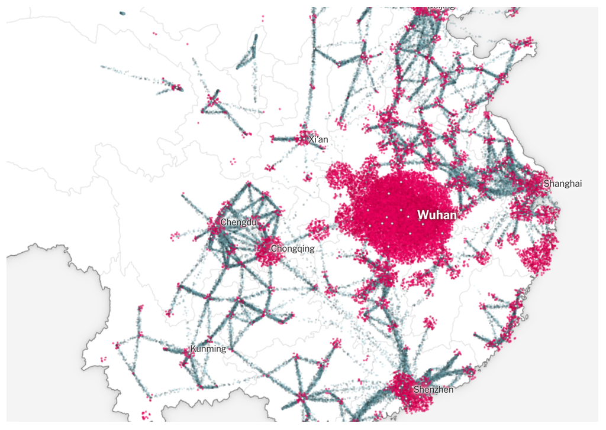
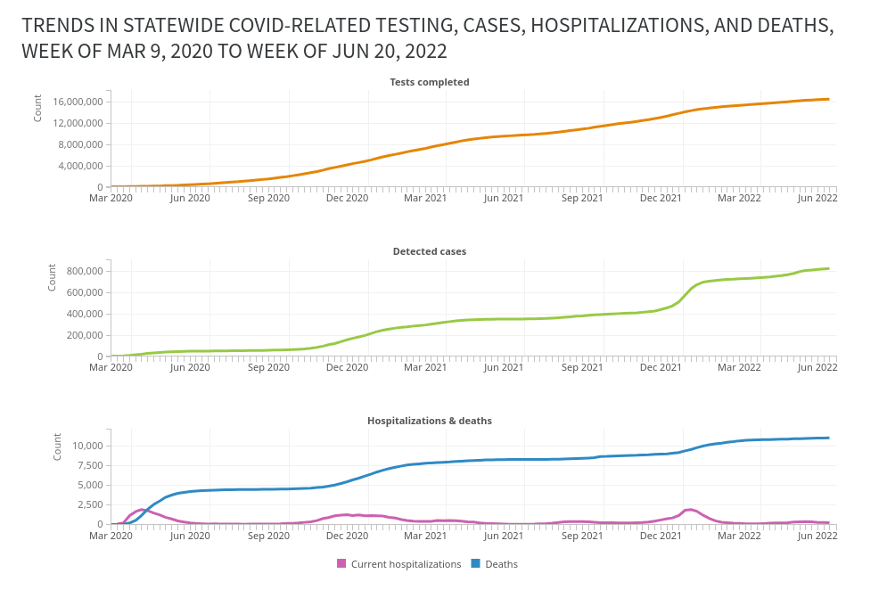
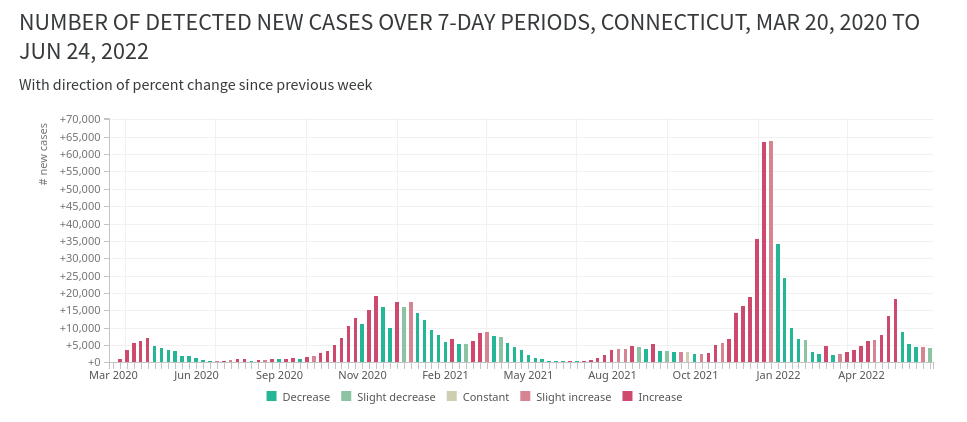

```{r}
#| label: setup
library(ggplot2)

theme_set(theme_minimal())
```

## Tools

- [ColorBrewer](https://colorbrewer2.org) (access to these palettes comes with ggplot)
- [Carto Colors](https://carto.com/carto-colors/) (access comes with the rcartocolor package)
- [Viz Palette](https://projects.susielu.com/viz-palette) generator & preview (doesn't work quite as well since they had AI rebuild it recently, be careful with the contrast checks for small lines!)
- [Gregor Aisch's chroma palettes](https://gka.github.io/palettes) generator
- [I Want Hue](https://medialab.github.io/iwanthue/) palette generator based on cluster analysis

I also like the similarly-named game [I Love Hue](https://i-love-hue.com/), which is a fun way to practice color perception and skills.

## Types of color palettes

The main types of color palettes are:

- sequential / quantitative: values are numeric and continuous; values and colors (saturation, lightness, hue) increase in some way in tandem
- diverging: values are likely numeric, but colors trend in opposite directions
- qualitative / categorical: values are _not_ numeric / continuous, and colors should _not_ imply continuity

::: {.aside}
I usually color ordinal values (categories with an intrinsic order, like education level or age group) the way I would a sequential palette, but I might increase the saturation at the lighter end of the palette.
:::

ColorBrewer and Carto Colors are great because they have options for all three of these.

These are rough examples using ColorBrewer palettes; in practice you might want to make some adjustments to these.

```{r}
#| label: palette-types
#| code-fold: true
#| fig-height: 2 
pals <- dplyr::tibble(
    sequential1 = seq(0, 1, by = 0.25),
    sequential2 = forcats::as_factor(c("0-1", "1-2", "2-4", "4-8", "8-16")),
    diverging1 = seq(-10, 10, length.out = 5),
    diverging2 = forcats::as_factor(c(
        "much lower",
        "lower",
        "no change",
        "higher",
        "much higher"
    )),
    qualitative1 = forcats::as_factor(c(
        "US",
        "Maryland",
        "Baltimore metro",
        "Baltimore city",
        "Downtown Baltimore"
    ))
)

make_legend <- function(
    x,
    col,
    pal,
    pal_type = "brewer",
    name = NULL,
    rev = FALSE
) {
    gg <- ggplot2::ggplot(x, ggplot2::aes(x = 1, y = 1, fill = {{ col }}))
    gg <- gg + ggplot2::geom_col()
    if (pal_type == "brewer") {
        gg <- gg +
            ggplot2::scale_fill_brewer(
                palette = pal,
                direction = 1,
                guide = ggplot2::guide_legend(reverse = rev)
            )
    } else {
        gg <- gg + ggplot2::scale_fill_fermenter(palette = pal, direction = 1)
    }
    gg <- gg + labs(fill = name)
    legend <- cowplot::get_legend(gg)
    cowplot::ggdraw(legend)
}

legends <- list(
    make_legend(
        pals,
        sequential1,
        pal = "RdPu",
        pal_type = "fermenter",
        name = "Sequential,\nevenly spaced"
    ),
    make_legend(
        pals,
        sequential2,
        pal = "RdPu",
        name = "Sequential,\nnot evenly spaced",
        rev = TRUE
    ),
    make_legend(
        pals,
        diverging1,
        pal = "BrBG",
        pal_type = "fermenter",
        name = "Diverging,\nnumeric"
    ),
    make_legend(
        pals,
        diverging2,
        pal = "BrBG",
        name = "Diverging,\nrelative",
        rev = TRUE
    ),
    make_legend(pals, qualitative1, pal = "Set2", name = "\nQualitative")
)
cowplot::plot_grid(plotlist = legends, nrow = 1)
```

## Purposes of color

Some of the reasons why you would use color in a chart:

- Presenting **values** (e.g. sequential palette in a heatmap or choropleth)
- **Highlighting** certain observations or values (e.g. baseline groups in gray, focus groups in a brighter color)
- **Tying information together** across several visualizations (e.g. every chart in a book uses the same color for ages 0-17, another for ages 18-34, etc.)
- Setting a **mood** (e.g. bright colors to get people to be alert, calm colors to make difficult information easier to swallow)

## Intentional use of color

It's easy to go overboard with coloring a visualization, so you want to keep asking yourself what purpose your colors serve, and to rethink your choices if you don't have an answer that's supported by the data. For example, people will often give each bar in a bar chart a different color (that's the default in software like Excel), but if the axis is labeled properly, you don't need different colors (you can choose to use them, just do it with intention).


```{r}
#| label: bars-color
#| code-fold: true 
hilite <- c("Maryland", "Baltimore city", "Baltimore County")

acs_county <- justviz::acs |>
    dplyr::filter(level %in% c("us", "state", "county"))

qual_pal <- rcartocolor::carto_pal(name = "Bold")

named_qual <- setNames(
    qual_pal[c(1, 2, 7)],
    c("Maryland", "Baltimore County", "Baltimore city")
)
less_than_hs_bars <- acs_county |>
    dplyr::filter(name %in% hilite) |>
    dplyr::mutate(name = forcats::as_factor(name)) |>
    ggplot(aes(x = name, y = less_than_high_school, fill = name)) +
    geom_col(width = 0.8) +
    scale_fill_manual(values = named_qual) +
    theme(legend.position = "none")

less_than_hs_bars +
    labs(
        title = "These colors don't do anything that the axis labels didn't already handle"
    )
```


An exception to that comes when you're working on a document with groups that carry over across multiple charts. In those cases, it can help readability and cohesion of the document to use the same colors for the same groups throughout.


```{r}
#| label: multi-charts
#| fig-height: 6 
scatter1 <- justviz::acs |>
    dplyr::filter(county %in% hilite) |>
    dplyr::mutate(county = forcats::as_factor(county)) |>
    ggplot(aes(
        x = less_than_high_school,
        y = median_hh_income,
        color = county
    )) +
    geom_point(alpha = 0.8, size = 1) +
    scale_color_manual(values = named_qual) +
    labs(
        title = "Median household income vs % \nwithout a high school diploma",
        color = NULL
    ) +
    theme(legend.position = "bottom")
unemp_line <- justviz::unemployment |>
    dplyr::filter(lubridate::year(date) >= 2019) |>
    dplyr::filter(name %in% hilite) |>
    dplyr::mutate(name = forcats::as_factor(name)) |>
    ggplot(aes(x = date, y = rate, color = name)) +
    geom_line(linewidth = 1) +
    scale_color_manual(values = named_qual) +
    labs(title = "Monthly unemployment rate, 2019–2025", color = NULL)

# cowplot helps stick different plots together
cowplot::plot_grid(
    cowplot::plot_grid(
        less_than_hs_bars +
            labs(title = "These colors tie together with\nother charts"),
        scatter1,
        nrow = 1,
        align = "h"
    ),
    unemp_line,
    ncol = 1,
    axis = "lr"
)
```

You can also use color to break up some information. I'll often do a series of charts focused on one place but compared to other places as well. For example, I might show shapes for comparison values in a gray color, and then shapes for my area of focus in an accent color.

```{r}
#| label: unemp-hilite
justviz::unemployment |>
    dplyr::filter(lubridate::year(date) >= 2019) |>
    # lump levels besides MD and Balt into "other counties"
    dplyr::mutate(
        label = forcats::as_factor(name) |>
            forcats::fct_other(
                keep = c("Maryland", "Baltimore city"),
                other_level = "Other counties"
            ) |>
            forcats::fct_relevel("Maryland", "Baltimore city")
    ) |>
    # use group argument to force lines to be drawn per county
    # even though they don't have their own colors
    ggplot(aes(
        x = date,
        y = rate,
        color = label,
        group = name,
        alpha = label,
        linewidth = label
    )) +
    geom_line() +
    scale_color_manual(values = c(named_qual, "Other counties" = "black")) +
    scale_linewidth_manual(values = c(1, 1, 0.4)) +
    scale_alpha_manual(values = c(1, 1, 0.2)) +
    labs(title = "Monthly unemployment rate by county, 2019–2025")
```


## Semantic colors

@fisher2025 goes into this well with the example of wanting to show the Banana Party in a banana yellow color and the Tomato Party in a tomato red color, but then having the yellow too washed out and the red too strong. You wouldn't want to compensate for that by using a completely different palette, though, because those names evoke specific colors (like it wouldn't make sense to show the Banana Party in blue).

::: {.assets}
If you want to take a deep dive into research on how we perceive and make meaning of color, iconography, and categories in data visualization, [Vidya Setlur](https://www.tableau.com/research/people/vidya-setlur) has done a lot of really interesting research at Tableau. One of her papers on color will be on the case study list.
:::

There are also ways we associate color with things in everyday life. Most frameworks for developing web or app interfaces will include semantic colors---"info" in blues or greens, "warning" in yellow or orange, "error" or "danger" in red.

](../assets/bootstrap.png)

### Standardized colors

If there are colors associated with the data you're showing, think about whether you want to use them or change them. You're balancing how easily people will read it accurately with your desire to break the mold. How problematic (visually, socially, etc) is it to stick with those standard colors? I might adjust the red and blue I use for Republicans and Democrats, for example, to give them equal brightness, but I'm not going to switch it up to green and orange. Those are organizations that have [unofficial but commonly accepted](https://en.wikipedia.org/wiki/Red_states_and_blue_states) branding. 

On the other hand, many outlets have moved away from pink and blue for women and men. (There was no convention at which women decided that yes, pink does represent us well. We don't have a branding department.) See @muth2018 for lots of examples. Again, you probably don't want to just swap colors and expect people to understand them. Personally, I usually go for a slightly greenish blue for men and a rich purple for women; sometimes we use blue and yellow or orange. 

## Meanings and moods of colors

@fisher2025 has a good discussion of how color sets moods ("hot" colors like reds, oranges, and yellows are energizing, "cool" colors like blues, purples, and greens are calming), as well as balancing the weights of colors.

::: {.aside}
Quantifying and defining color "weight" is something people have been trying to do for more than a century. It's a subjective phenomenon that seems to be based on some combination of hue (blues & reds are heavy, yellows are light) and saturation (how red is the red?), among other factors. @pinkerton1974 is one example of an attempt to measure this.
:::

Because of its associations with danger, I pretty much never use bright, saturated reds in my own visualizations. I'm often visualizing inequalities and impacts of things like chronic disease, and I need my work to not feel scary or jarring to the reader. So I opt for purples, blues, and teals for accents; blue-green or purple-peach palettes for sequences; and earthy tones for diverging palettes.

Compare these visualizations of covid data. The first is by the New York Times, and the second and third are by me. 







I'm not saying I'm doing this better than the folks at The Upshot; I'm saying we had different priorities. The New York Times' priority is to sell newspapers and get people to pay attention to the news. My organization's priority was to help local health departments and school districts communicate information to residents with urgency but not fear. Earlier on, before there was other data available, we had a choropleth on that site that used a purple color scale. I used blues and purples for trends in deaths and test positivity rate, and even with the diverging scale (third panel), I intentionally muted the red and, in hindsight, should have increased the saturation of the greens.

## Color names

Opt for colors that are easy enough to name, or that at least would be named distinctly from each other. You want your readers to be able to say "the light blue bars mean this and the purple ones mean that" instead of trying to differentiate between peachy pink-orange and orangish yellow. Some tools will give you names for your colors to help see how people might refer to them.

## Contrast and size

We'll experiment with this in the lab, but along with the idea of colors having weights, you'll find that colors of small marks can be harder to distinguish from one another than large marks. You can test for this with the Viz Palette tool, although this pretty unique feature is what seems to have broken with the recent AI rebuild. We'll also experiment with how colors interact, based on the work of [Josef Albers](https://www.albersfoundation.org/), and how the colors in your charts will change depending on their surroundings and their relationships with each other.

Some examples:


Which row uses a darker color?

```{r}
#| label: contrast-points
#| echo: false
#| fig-height: 2
#| fig-width: 7
set.seed(1)
dummy <- dplyr::tibble(
    x = rep(1:5, times = 3),
    y = rep(letters[1:3], each = 5),
    z = sample(letters[1:2], size = 15, replace = TRUE, prob = c(0.3, 0.7))
)

dummy |>
    dplyr::filter(y != "c") |>
    ggplot(aes(x = x, y = y, shape = y, color = y)) +
    geom_point(size = 5, show.legend = FALSE, stroke = 1) +
    scale_shape_manual(values = c("circle", "circle open")) +
    scale_color_manual(values = c("gray60", "gray45")) +
    theme_void()
```


Which line uses a darker color?

```{r}
#| label: contrast-line
#| echo: false
#| fig-height: 3
#| fig-width: 7
dummy |>
    dplyr::filter(y != "c") |>
    ggplot(aes(x = x, y = y)) +
    geom_tile(aes(fill = y), show.legend = FALSE) +
    geom_line(linewidth = 2, color = "gray70") +
    scale_fill_manual(values = c("gray10", "gray90")) +
    theme_void()
```

How many purple dots are in each row?

```{r}
#| label: contrast-dots
#| echo: false
#| fig-height: 2
#| fig-width: 7
ggplot(dummy, aes(x = x, y = y, color = z, size = y)) +
    geom_point(show.legend = FALSE) +
    scale_size_manual(values = c(1, 3, 9)) +
    scale_color_manual(values = qual_pal[c(1, 3)]) +
    theme_void()
```

## Miscellaneous things

Pay attention to the background of your chart. ggplot's default theme uses a gray background; it's fine but I personally don't love it. You might need to increase contrast of your shapes' colors in order to work over a gray background rather than a white one.

Don't use colors that are associated with racial or ethnic groups or that are used in stereotypes. I've seen this happen accidentally. Don't be weird.

