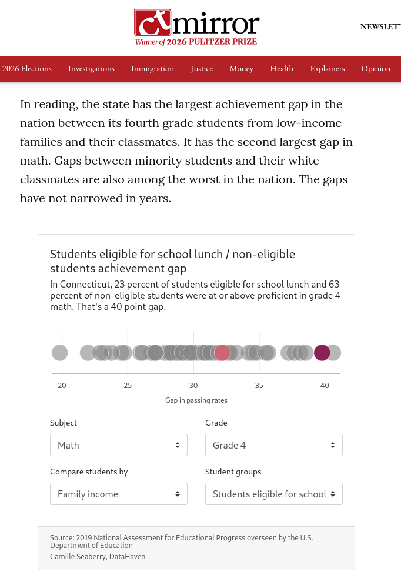
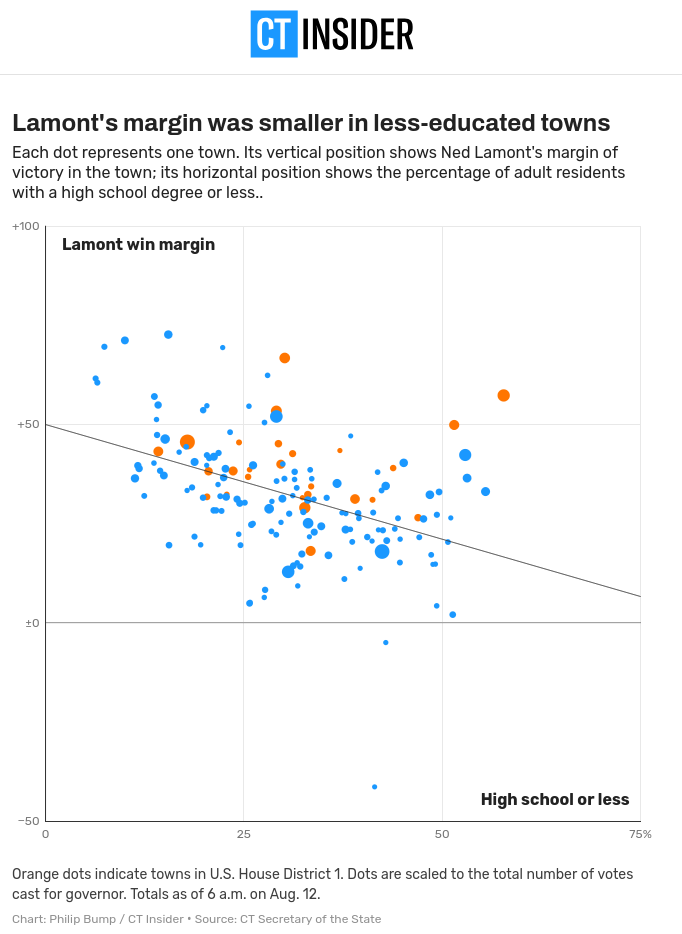

## Big picture: providing context and making meaning

> "Until the systems of power recognise different categories, the data I'm reporting on is also flawed," she added.
> 
> In a bid to account for these biases, and any biases of her own, Chalabi is transparent about her sources and often includes disclaimers about her own decision-making process and about any gaps or uncertainties in the data.
> 
> "I try to produce journalism where I'm explaining my methods to you," she said. "If I can do this, you can do this, too. And it's a very democratising experience, it's very egalitarian."
> 
> In an ideal scenario, she is able to integrate this background information into the illustrations themselves, as evidenced by her graphics on anti-Asian hate crimes and the ethnic cleansing of Uygurs in China.
> 
> But at other times, context is relegated to the caption to ensure the graphic is as grabby as possible.
> 
> "What I have found is literally every single word that you add to an image reduces engagement, reduces people's willingness or ability to absorb the information," Chalabi said.
> 
> "So there is a tension there. How can you be accurate and get it right without alienating people by putting up too much information? That's a really, really hard balance."
>
> -- Mona Chalabi in @hahn2023


> A data visualization is not a piece of art meant to be looked at only for its aesthetically pleasing features. Instead, its purpose is to convey information and make a point. To reliably achieve this goal when preparing visualizations, we have to place the data into context and provide accompanying titles, captions, and other annotations. 
>
> -- @wilke2019 ch. 22

## Using text

The type of text you use, phrasing, and placement all depend on where your visualizations will go, who will read them, and how they might be distributed. For example, I might put less detail in the titles and labels of a chart that will be part of a larger publication than a chart that might get distributed on its own (I'll also tend towards more straightforward chart types and simpler analyses for something standalone).

Different styleguides and publication requirements may have different standards in how you need to use text. Some styleguides require every axis be explicitly labeled, for example, whereas I usually assume my readers know that an x-axis with ticks for 2010, 2015, 2020, ... is a date, or I'll squeeze that sort of explanation into a subtitle (e.g. "Share of households without a vehicle, Maryland tracts, 2024") instead of directly on the axis. You might be required to do differently, so just be mindful of that.

Identify all the text in this chart, what purpose it serves, and whether that could be done better through other means.


```{r}
#| label: identify-text
#| fig-height: 6 
#| fig-alt: "A horizontal bar chart of cost burden rates by county in Maryland, plus the statewide and US rates. Bars are colored differently for the US, Maryland, Baltimore city, or other counties. The headline reads, 'Baltimore city has the highest cost burden rate in the state.'"
library(ggplot2)
theme_set(theme_minimal())
percent <- scales::label_percent(accuracy = 1)
qual_pal <- rcartocolor::carto_pal(n = 4, name = "Bold")

cost_burden_county <- justviz::acs |>
    dplyr::filter(level != "tract") |>
    dplyr::select(name, total_cost_burden) |>
    dplyr::mutate(
        level2 = forcats::as_factor(name) |>
            forcats::fct_other(
                keep = c("United States", "Maryland", "Baltimore city")
            )
    ) |>
    dplyr::mutate(name = forcats::fct_reorder(name, total_cost_burden)) |>
    dplyr::mutate(pct = percent(total_cost_burden))

head(cost_burden_county)

ggplot(
    cost_burden_county,
    aes(y = name, x = total_cost_burden, fill = level2)
) +
    geom_col(width = 0.8) +
    geom_text(
        aes(label = pct),
        hjust = 1,
        color = "white",
        fontface = "bold",
        nudge_x = -0.005
    ) +
    scale_x_continuous(labels = percent) +
    scale_fill_manual(values = qual_pal) +
    labs(
        title = "Baltimore city has the highest cost burden rate in the state",
        subtitle = "Share of households that are cost burdened, Maryland, 2024",
        caption = "Source: US Census Bureau American Community Survey, 2024 5-year estimates",
        x = "Cost burden rate",
        y = "Location",
        fill = "Geographic level"
    ) +
    theme(
        panel.grid.major.y = element_blank(),
        panel.grid.major.x = element_line(),
        plot.title.position = "plot",
        plot.caption.position = "plot"
    )
```

::: {.callout-tip}

### Brainstorm

| Text element | Purpose | Improvements? |
| ------------ | ------- | ------------- |
|              |         |               |
|              |         |               |
|              |         |               |
|              |         |               |
|              |         |               |
|              |         |               |
|              |         |               |
|              |         |               |
|              |         |               |

:::

### Titles

Different organizations and publications will also have guidelines for the types of text you write. My organization's work needs to generally be publicly accessible. Several years ago, we decided to try transitioning most of our charts from descriptive titles ("Cost burden rates by county") to narrative ones ("Baltimore city has the highest cost burden rate in the state"). This frames the chart so that the reader is guided toward what we think is the most important takeaway message, and doesn't require them to be able to make that judgment on their own. However, there is often not a *single* most important finding or pattern, so this may be a way you unintentionally introduce bias and subjectivity to your work (hot take: none of the data we work with is purely [objective](https://data-feminism.mitpress.mit.edu/) and [unbiased](https://d4bl.org/) anyway).

We don't always do narrative titles, though: in a more technical document we might not, and we generally think of tables as a more technical counterpart to a chart, so we usually just use descriptive ones there too.

### Direct labeling

Direct labeling is a use of text that is more about your specific data than the messaging, but it's again a technique that helps your reader make sense of the data. This is where you place labels at specific points, such as labeling the value at the end of every bar in a bar chart, or labeling the endpoints of each line in a line chart. This can also let you eliminate some annotations, such as axis labels or legends, leaving your reader with fewer separate elements to read and fewer dots to connect as they move back and forth (some explanations of this in @wilke2019 section 20.2).

With ggplot, you'll do this with `geom_text` or `geom_label` (or similar functions from packages like [`ggrepel`](https://github.com/slowkow/ggrepel) or [`ggtext`](https://github.com/wilkelab/ggtext)).

Labeling observations lets you drop the axis and gridlines, and gives your reader exact values instead of having to estimate them by position within the grid. Which of these is easier to read precisely?

```{r}
#| label: direct-labels-obs-1
#| fig-width: 5 
#| code-fold: true
#| fig-alt: "A bar chart of owner cost-burden rates in 2024 for the US, Maryland, Baltimore County, and Baltimore city. The chart illustrates the use of direct labels on each of the bars." 
county_to_lbl <- justviz::acs |>
    dplyr::filter(
        name %in%
            c("United States", "Maryland", "Baltimore city", "Baltimore County")
    ) |>
    dplyr::mutate(name = forcats::as_factor(name)) |>
    dplyr::select(name, owner_cost_burden, renter_cost_burden)

county_to_lbl |>
    dplyr::mutate(lbl = percent(owner_cost_burden)) |>
    ggplot(aes(x = name, y = owner_cost_burden)) +
    geom_col(alpha = 0.9, fill = qual_pal[2]) +
    geom_text(
        aes(label = lbl),
        nudge_y = -0.01,
        color = "white",
        fontface = "bold",
        size = 5
    ) +
    scale_y_continuous(labels = NULL) +
    labs(
        x = NULL,
        y = NULL,
        title = "Owner cost-burden rate, 2024",
        alt = "test"
    ) +
    theme(panel.grid = element_blank())
```

```{r}
#| label: direct-labels-obs-2
#| fig-width: 5
#| code-fold: true
#| fig-alt: "A bar chart of renter cost-burden rates in 2024 for the US, Maryland, Baltimore County, and Baltimore city. The chart illustrates the use of a grid on the y-axis to show values, rather than direct labels."  
county_to_lbl |>
    ggplot(aes(x = name, y = renter_cost_burden)) +
    geom_col(alpha = 0.9, fill = qual_pal[2]) +
    scale_y_continuous(labels = percent) +
    labs(x = NULL, y = NULL, title = "Renter cost-burden rate, 2024") +
    theme(panel.grid.major.x = element_blank())
```

However, it's not always necessary to know the exact value of every observation. Don't label every point in a scatterplot, or try to label the count of every bin in a histogram. In those sorts of cases, focus on the overall pattern and noteworthy deviations (as always, this requires knowing your data and its context well).

Sometimes it can be tricky to use labels in place of legends, but it's often a good idea, such as in Wilke's examples with the line chart of stock prices. I'll often make a little data frame of just the subset of my data that lets me show the labels I want. That might mean just the start and/or end points of a line chart, or a single observation (usually either the first or last) of bars I want to label. We'll write some helper functions for this in this week's lab.

In this example, I want labels at the last date for each location. `dplyr::slice_max` is a shorter way to filter for rows where the date is equal to the maximum value of all dates in the data frame.

::: {.aside}
One thing to note with timeseries data is that the units will be based on days. So something like `nudge_x = 30` will mean moving a marking over by the equivalent of 30 days within this scale.
:::

```{r}
#| label: direct-labels-legend
#| code-fold: true
#| fig-alt: "A line chart of unemployment rates from 2019 to 2025 for Maryland, Baltimore city, and Worcester County. The chart illustrates using direct labeling of the individual lines rather than a legend." 
unemp_to_lbl <- justviz::unemployment |>
    dplyr::filter(lubridate::year(date) >= 2019) |>
    dplyr::filter(
        name %in% c("Maryland", "Baltimore city", "Worcester County")
    ) |>
    dplyr::mutate(name = forcats::as_factor(name))

# if I thought different locations might have different end dates,
# I'd need to group by location first, and take max date for each
unemp_last_date <- unemp_to_lbl |>
    dplyr::slice_max(date)

ggplot(unemp_to_lbl, aes(x = date, y = rate, color = name)) +
    geom_line(linewidth = 1) +
    # use the smaller data frame for geom_text
    # left-align labels with hjust, then nudge them
    geom_text(
        aes(label = name),
        data = unemp_last_date,
        hjust = 0,
        nudge_x = 30,
        fontface = "bold"
    ) +
    scale_color_manual(values = qual_pal) +
    # expand the range shown by adding extra days to right side
    scale_x_date(expand = expansion(add = c(30, 365 * 2))) +
    theme(legend.position = "none") +
    labs(title = "Unemployment rate, 2019-2025")
```


## Audience

Tailor your work to your audience. That includes understanding:

* who's reading it
* their background knowledge, experiences, and familiarity with the data
* their purpose in reading it
* the context in which they're reading it
* what (if anything) you want them to do with the information

I'm going to make different charts of the same data to present to a local board of education vs the math teachers in that district vs their students. I'm going to use different framing for a visualization that accompanies a technical report vs a political petition.

One of the first considerations you'll make is the type of chart. I've said it already but I'm very jealous of everyone who can publish a histogram; I'm pretty much always working for an audience that I can't assume knows how to read a histogram. I have to either pick a different chart type, or couch it in annotations and other helpers to teach my reader how to read it (interactive visualization makes this a little easier).

::: {.aside}
Here's one project where I *was* able to display distributions of data, but that included more text than I might use otherwise, interaction, and user choices, and accompanied a 3,000-word article written by a very skilled, data-focused journalist.

{fig-alt="A screenshot of a dot plot of the gap in math standardized testing scores between students who qualify for free or reduced lunch and those who do not. The chart has several dropdown menus available for readers to choose the subject, grade, and comparison groups to show, and is incorporated into a longer article."}
:::

That's not to say you can't or shouldn't use more complex charts in all situations; you might just need to use text and annotations, and maybe break the chart down into several parts, in order to guide your audience. Here's an example of one of several charts that accompany a newspaper article; check out how much care was put into making a relatively complex chart legible.

{fig-alt="A screenshot of a scatterplot from the online newspaper CT Insider. The headline of the chart reads 'Lamont's margin was smaller in less-educated towns,' and shows one dot per town. The percentage of each town with a high school degree or less is on the x-axis, and Lamont's win margin is on the y-axis. The dots show a negative correlation."}

## Accessibility

Throughout my time doing data viz, accessibility has been a major oversight
of mine, but it's true, and it's for no other reason than privilege. On
a day-to-day basis I don't have to think about whether learning or
interacting with something will depend on my ability to see well, read
complicated text, speak a certain language, navigate stimuli, process
information, or access technology and resources. My hope for you all is
that you **start out your data viz careers being more mindful than I've
been.**

For the most part when we talk about accessibility, we mean this with
respect to disabilities; in static data visualization, this mostly means
visual impairments such as blindness, low vision, and colorblindness/color vision deficiency (CVD). If
you go on to do interactive or web-based visualization, you'll also need
to think about things like navigation (access for keyboards and
assistive devices vs clicking menus only) and animation (can be
overstimulating or hard to process). 

::: {.aside}
Circa 2017, scrollytelling was very cool and people were *very
intense* with it. I've noticed in recent years people have eased up.
It can be disorienting for some readers. @webb2018 convinced me to
scrap my scrollytelling plans for some projects during that era. I tried something similar once, and it made my partner with ADHD very agitated.
:::

Some of the simplest tasks we can do for static data visualization are
using **colorblind-friendly palettes**, writing **alt-text
descriptions**, and maintaining high **contrast ratios** between
backgrounds and text.

### Colorblindness / color vision deficiency

You should generally assume your work will be read by at least a few
readers with CVD and
plan your color palettes accordingly. Wilke mentions this as a reason
for [redundant
coding](https://clauswilke.com/dataviz/redundant-coding.html) as well,
so you're not relying on color alone to differentiate values. 

::: {.aside}
Something that blew my mind is in Frank Elavsky's interview on
*PolicyViz*. He acknowledges that awareness of CVD has become the
norm in data viz, but that it actually predominantly affects white
men, and that it shouldn't be too surprising that that is often the
only accommodation made in a field where white men are
overrepresented.
:::

The most common form of CVD is what's called red-green colorblindness.
Many common R color palettes are colorblind-friendly, and some tools
will help you tell whether a palette is or not, or for which color
deficiencies they are legible.

Some code examples:

```{r}
#| label: swatches
# Not all Color Brewer palettes are CVD-friendly, but you can filter in the R package
# or on the website for ones that are
RColorBrewer::display.brewer.all(colorblindFriendly = TRUE)

# Same goes for Carto Colors
rcartocolor::display_carto_all(colorblind_friendly = TRUE)

# All Viridis palettes are designed to be CVD-friendly
# use them with e.g. scale_fill_viridis_c()
colorspace::swatchplot(viridisLite::viridis(n = 9))

# Okabe-Ito is built into R and based on lots of research into CVD
colorspace::swatchplot(palette.colors(n = 9, palette = "Okabe-Ito"))
```

There are also a lot of tools to help you simulate different types of
CVD. This is particularly useful for diverging palettes, which can be
hard to make accessible.

```{r}
#| label: dots-cvd
#| echo: true
#| fig-height: 3
#| fig-width: 7
#| fig-alt: "A colored dot plot shown as an example of simulations of different types of color vision deficiencies. The original palette is not colorblind friendly, as shown by the simulations."

set.seed(1)
cvd_data <- data.frame(
    group = sample(letters[1:7], size = 200, replace = TRUE),
    value = rnorm(200)
)
div_pal <- RColorBrewer::brewer.pal(n = 7, name = "RdYlGn")

p <- ggplot(cvd_data, aes(x = value, fill = group)) +
    geom_dotplot(method = "histodot", binpositions = "all", binwidth = 0.2)

p +
    scale_fill_manual(values = div_pal) +
    labs(title = "Brewer palette RdYlGn")

p +
    scale_fill_manual(values = colorspace::deutan(div_pal)) +
    labs(title = "Deuteranomaly")

p +
    scale_fill_manual(values = colorspace::protan(div_pal)) +
    labs(title = "Protanomaly")

p +
    scale_fill_manual(values = colorspace::tritan(div_pal)) +
    labs(title = "Tritanomaly")
```

There are lots of tools to do similar simulations, although many of them
require you to have a graphic already saved to a file. An online one
that's good for developing and adjusting palettes is [Viz
Palette](https://projects.susielu.com/viz-palette) by Susie Lu; this one
also accounts for the size of your geometries. **However**, as I mentioned when we talked about color more broadly, a recent AI rebuild of the site seems to have made the contrast checker for small markings sometimes not work, so be careful.

::: aside
Viz Palette takes a set of space- or comma-separated colors as hex
values. If you have a vector of colors, call

``` r
cat(div_pal, sep = " ")
```

to get it all in one line that you only have to copy & paste once.
:::

### Alt text

Alt text is the text that's displayed in place of, or alongside, an
image online and in some types of documents (certain PDF versions,
Microsoft Word, etc). If someone is using a screen reader, it will read
this text aloud. This can be embedded in posts on most social media
platforms as well, and is autogenerated on some (if you ever look at
Facebook with a bad internet connection, you might see alt text until
the images load.) As the designer of your visualizations, you're in a
unique position to write alt text, since you will have close knowledge
of the data and what's important about it.

Including alt text in R:

-   For exporting ggplot charts in some file formats, you can include alt text in
    `labs(alt = "")`.
-   In Rmarkdown documents, you can include it as the `fig.alt` chunk
    option
-   Similar for Quarto documents: `fig-alt`
-   When directly including images in Markdown, use
    `{fig-alt="Alt text goes here"}`

### Contrast

Different pieces of your visualization need to have enough contrast to
be legible at different sizes, especially between text and its
background. This comes up with labels like titles, but especially with
direct labels. Generally your labels will be all white or all black (or
slightly darker or lighter, respectively), so if you're putting direct
labels on several bars with different colors, make sure you have enough
contrast across all of them.

For example, this palette starts out very dark and ends very light, so
neither white nor black will be legible across all bars. Switching
between label colors (light on the dark bars, dark on the light bars)
can be distracting or imply something about the data that isn't there,
so it's better to use a palette where all labels can be the same color.

```{r}
#| label: bad-contrast
#| fig-alt: "A bar chart of simulated data in a color palette that ranges from black to very light yellow. The bars have labels in black, gray, and white, but because there is such a wide range in lightness values of the colors, no label color has enough contrast across all bars."

inferno <- viridisLite::inferno(n = 7)

cvd_counts <- cvd_data |>
    dplyr::count(group)
cvd_labels <- tibble::tibble(
    color = c("white", "gray", "black"),
    y = seq_along(color) * 5
) |>
    dplyr::cross_join(cvd_counts)

cvd_counts |>
    ggplot(aes(x = group, y = n, fill = group)) +
    geom_col() +
    geom_text(
        aes(label = n, y = y, color = color),
        data = cvd_labels,
        fontface = "bold"
    ) +
    scale_color_identity() +
    scale_fill_manual(values = inferno)
```

The W3C recommends a minimum contrast ratio of 4.5 for regular-sized
text, and 3 for large text. You can use `colorspace::contrast_ratio` to
get calculations of these ratios.

```{r}
#| label: contrast-ratio-wcag
#| fig-alt: "A grid to measure the contrast ratio between text and background. In the first panel, the background is black and the text is in a black to light yellow color palette. In the second panel, the background and text are reversed so that the text is black and the backgrounds are the black to light yellow color palette. The darkest purple colors have inadequate contrast, while the highest contrast ratio, between black and light yellow, is 19.98."
colorspace::contrast_ratio(inferno, col2 = "black", plot = TRUE)
```

I learned while prepping for this semester that there are new proposed web accessibility standards that haven't been adopted yet, and probably won't be for another few years. The [proposed color contrast algorithm](https://apcacontrast.com/) is in beta, and it accounts for not just the contrast between two colors, but their markings' relative sizes and contexts. That's more directly applicable to us in testing contrasts for data viz, since we know that colors of points in a scatterplot are likely harder to tell apart than large bars in a bar chart. You can try this algorithm with the previous function:

```{r}
#| label: contrast-ratio-apca
#| fig-alt: "The same grid of colors and contrast ratios as before, but now the APCA algorithm is used. This differentiates between which color is used for the text and which is used for the background in calculating the contrast ratio." 
colorspace::contrast_ratio(
    inferno,
    col2 = "black",
    algorithm = "APCA",
    plot = TRUE
)
```

### Literacy

We may easily take for granted the ability to read English fluently, but
it's important to remember that, depending on our audience, many of our
readers may not be able to. Twenty-two percent of US adults ages 16 to
74 are rated as having low literacy; in Maryland, this is 20%
[@piaac2020]. [^3] So if you're creating a visualization that needs to
work for a general audience, you'll want to keep your sentences short,
language simple, and chart types pretty standard. 

There are some tools online to estimate reading level algorithmically, though this can be problematic. One I've used is the [Flesch-Kincaid grade level test](https://www.wordcalc.com/readability/). 

[^3]: This program outlines definitions of "low literacy," but in news
    stories and Wikipedia it's being referred to as corresponding to a
    sixth grade reading level. I haven't found anything directly
    connected to the program that corroborates that.

### Other very cool techniques

People have come up with lots of other creative ways to make data visualization more accessible, including by bypassing the visual component. I've heard of people doing data sonification, physical data sculptures you can touch, and visualizations that incorporate braille.
