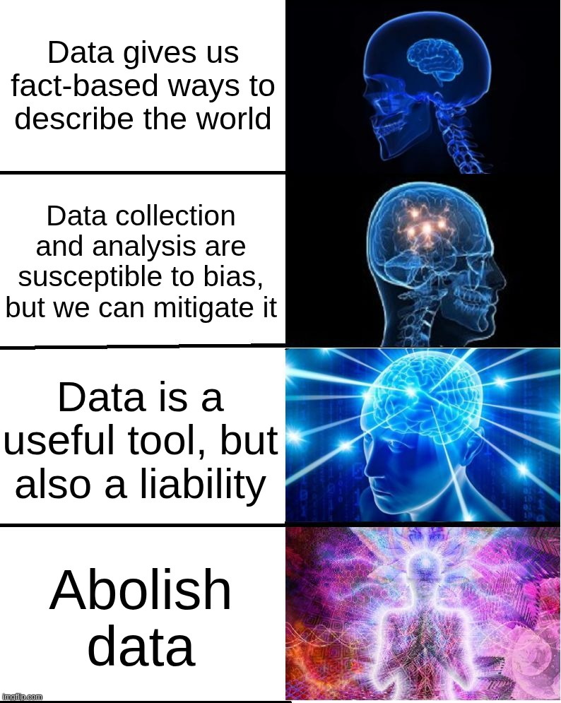
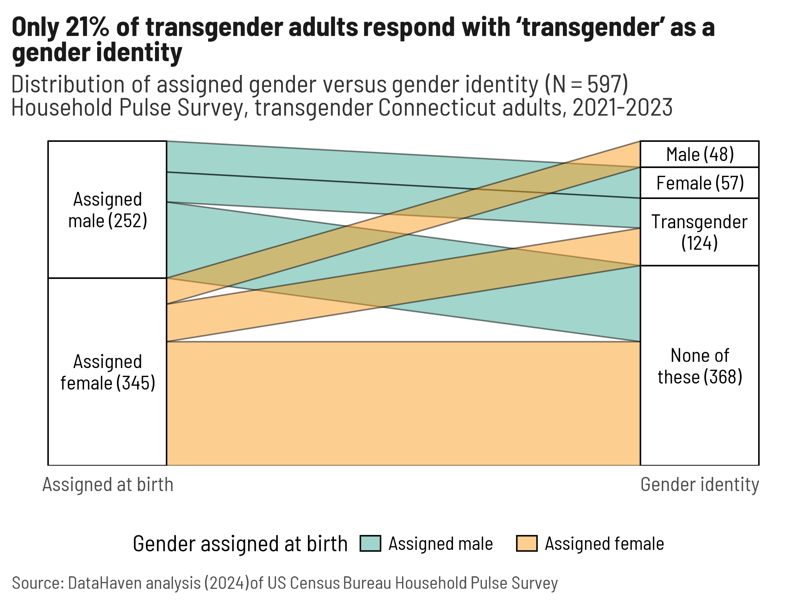
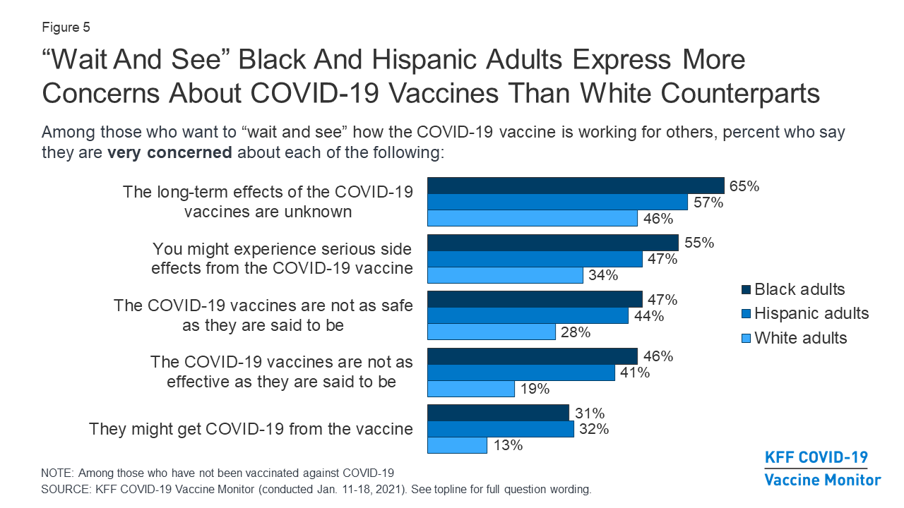
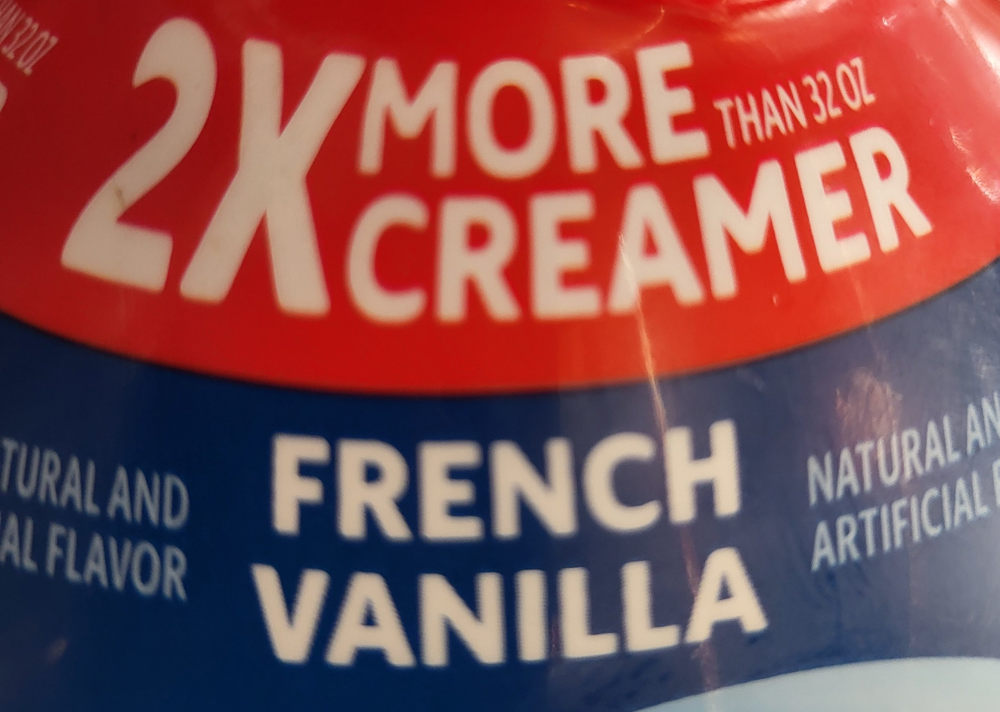
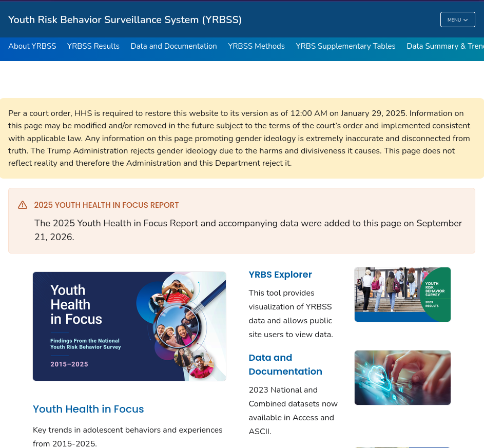

This is where we get to my galaxy-brain takes on collecting and presenting data and the Critical GIS foundations of this program. 

{width=80% fig-alt="A 'galaxy brain' meme. Level 1: 'Data gives us fact-based ways to describe the world.' Level 2: 'Data collection and analysis are susceptible to bias, but we can mitigate it.' Level 3: 'Data is a useful tool, but also a liability.' Level 4: 'Abolish data.'"}

We've already talked about writing good, reproducible code and making good decisions, and how your choices frame the information your reader gets from your work. We've even tried our hands at intentionally manipulating data. But your ethical considerations in doing data viz are even bigger, and span the whole continuum from definition to collection to analysis to visualization to dissemination. 

And that's in a good case: what if your readers don't trust you, or *shouldn't* trust you? What do you do when someone uses your work in harmful ways? Not to mention the infrastructure and materials we use: labor that goes into mining metals, assembly of computers, and labeling training data; impact of data centers; e-waste; reliance on tech giants...it all becomes so much!

In this class, we're just focused on a slice of this mess, but because it's a slice that's most often concerned with communicating with the public, we do need to bring in a lot of critical thought about our roles. The things I've found most helpful to keeping myself out of this spiral (yeah right) are:

* recognizing my **responsibility** to my reader
* **building trust** with my audience
* **preempting misuse** of my work 
* **saying no** when I can't or won't do something

## Responsibility

When you're visualizing data for an audience (i.e. not EDA), you're saying that you know something about that data that the audience probably doesn't. Your readers are relying on you to know what you're talking about. That's part of why **exploring your data first is so important**. 

But that also might not cut it. You might be out of your depth as far as methodologies or fields of study go. Be willing to read papers and study other projects to understand their methodologies, build connections with people at your organization or other orgs, contact the researchers or publishers of the data you're using, change course or abandon a project altogether when you're wrong or hitting a wall, and generally learn to ask lots of good questions. Then there's all the ways that people skew their data or methods to force something to work, even if it ends up [not reproducible](https://statmodeling.stat.columbia.edu/category/zombies/). 

You can approach your work with curiosity, integrity, and humility, and **you'll still hit limits**: no amount of EDA or asking a friend is going to make me able to visualize data about international monetary policy well, and that's okay. It's just not something I can or should do.

> Study every day.
>
> -- My father-in-law whenever he's asked for life advice

## Trust

One of the best ways you can build trust with your audience is by **getting to know the communities** where your work is used and forming long-term relationships there. This is also the hardest and slowest way. My organization has that where we're based, but it's been built up over decades, and we wouldn't necessarily have that reputation in a new place. We also do a lot of our projects in partnership with other organizations and agencies that have been around even longer, or are more deeply embedded in their specific communities. 

::: {.aside}
When you try to do research about a community that you don't have connections to, you might end up doing things like trying to ask about gender identity but doing it very very badly. Here's how I illustrated the ways poor wording messed up our analysis for a conference presentation in 2024 (btw this is called a Sankey diagram). I noticed it right away because I'd helped rewrite our survey's gender identity question (it used to be bad), and had recently helped a friend who is trans fill out paperwork with a similarly awkward question. 

Later, the question and any references to gender identity were removed altogether by the current federal administration.

{fig-alt="A Sankey diagram showing transgender respondents to a pair of survey questions about gender. The first question asks for sex assigned at birth, with the choices of male or female. The second asks for gender identity, with the choices male, female, transgender, or none of these. The majority of respondents answer 'none of these.' The chart's heading reads, 'Only 21% of transgender adults respond with \'transgender\' as a gender identity.'"}
:::

If there's a problem you want to tackle with visualization, first **find the people on the ground** addressing it, get to know what they've already done or what they need, and _from there_ figure out how you can tap in. 

Other ways you can build trust are being open and honest about what you can and cannot do, what the limitations are in your data, and where the data comes from. Be upfront about the data's uncertainties and nuances and quirks. Incorporate those things into your visualization when it makes sense, and build context to explain the nuances. Don't oversell what you don't know or can't predict.

**You're going to make mistakes in your work**. I messed up the calculations of a major indicator we use a lot, and I noticed it the day the report was going to print, when it was too late to fix it. We put an erratum note online, but I felt foolish, and I always triple-check that calculation now or pass it off to someone else entirely. It puts you in a vulnerable position to admit that you made a mistake in a professional or research setting, but I do truly think it builds good will with your peers and shows that you approach your work with integrity.

## Mistakes and misuse, deliberate or otherwise

When you create a visualization and plan to release it publicly, think through all the ways it could be misinterpreted or used for bad purposes. Then, if you can, try to protect against that, knowing that it might not be entirely possible. Sometimes this means **leaving things out** of your analysis or visualization. 

For example, my organization's survey asked the same questions as KFF about people's plans for getting vaccinated against covid, but we made different choices about what to publish. One of the answer choices for why people didn't plan on getting vaccinated was that they might get covid from the vaccine. That's a valid concern, but it's rooted in misinformation rather than science. We went back and forth about what to do with that answer, and considered including it with an asterisk noting that this isn't possible, but ultimately didn't trust that people would read and interpret that correctly. So instead, when we published results of that question, we left that reason out. KFF published it with no caveats.

{fig-alt='Bar chart of KFF survey questions on concerns adults have about the COVID-19 vaccines as of January 2021, among adults who say they want to wait and see how the vaccines work before getting them. The data is broken down by race for Black, Hispanic, and white adults, and Black adults are most likely to express concerns. The highest ranked concern is "the long-term effects of the COVID-19 vaccines are unknown."'}

Similarly, we limited how much we put out about differences in vaccine hesitancy by race/ethnicity, because there was no way we could include the amount of context (e.g. [the Tuskegee Syphilis Study](https://web.archive.org/web/20260930185823/https://www.cdc.gov/tuskegee/about/index.html), [forced sterilizations](https://www.pbs.org/independentlens/blog/unwanted-sterilization-and-eugenics-programs-in-the-united-states/)) necessary to validate real concerns that especially Black, Latino, and Indigenous people might have during a vaccination campaign or other quick push for medical treatments. It simply wouldn't fit in a bar chart.

## Saying no

If you've decided that there's work you shouldn't do---because you're not the right one to do it, or you don't think it should be done---**just say no**. Knowing how to work with data and visualize it well will have you better able to propose alternatives. 

For example, when it was becoming clear that covid was going to be a big deal but unclear what it would look like, my organization got asked a lot of questions that we couldn't answer. They were big questions ("How bad will this be?", "How long will schools need to close?") that needed to go to an epidemiologist, which none of us are, and any epi would have also said they simply didn't know. So we would answer that we're not epis but could help figure out some of the context surrounding the problem. We didn't know when schools would need to close or for how long, but, since schools were going to move online, we could calculate what percentage of kids in each town lived in a house without broadband internet and a computer, or how many households had both kids who would be going back to school and their grandparents who might be at higher risk if the kids brought the virus back home. It felt extremely unsatisfying to not be able to give people answers, but that was the best we could responsibly do. 

You'll practice this with a much sillier scenario as part of your final project.

## Data in the zeitgeist

{width=50% fig-alt="A close-up photo of a bottle of coffee creamer. In large text, the bottle says, '2X more creamer,' but in smaller print, adds 'than 32 ounces.'"}

We're in an environment where data about us is being collected, sold, distributed, and stolen far more than we realize, let alone consent to. Beyond that are many ways that we compromise or hand over our data in exchange for "free" services (e.g. social media), discounts (e.g. grocery store rewards cards), and privileges (e.g. driver's licenses---mine was recently counterfeited). It's likely that, at some point, you'll visualize data that you don't feel great about, such as by being asked to do something with data that you don't think is fully just or that loses necessary nuance, or by using data collected through dubious means. In these cases, you might decide that the benefits outweigh the harms associated with the data, or that you can change the project in some way to minimize the problem. Or you might refuse to do something and take a personal and professional risk. I've done all of these. Again, **the better you've done your research, the better prepared you are to take a stand** that feels right to you.

There are also many things happening right now to alter or weaponize data for political or ideological means, including by trying to [take away access](https://www.kff.org/racial-equity-and-health-policy/disappearing-federal-data-implications-for-addressing-health-disparities/). There are also many people working to preserve data, and sometimes we manage to stay one step ahead or to [build alternatives outside of government](https://www.climate.us/). [Nathan Yau](https://flowingdata.com/tag/takedown/) has done some posts following changes to federal data, particularly data related to climate change. Some other resources I like:

* [The SciOp project](https://sciop.net/) which collects and distributes torrents of threatened or deleted datasets from a variety of sources
* [DataIndex's tracker](https://dataindex.us/terminations-tracker), how I found out that portions of the literacy survey I referenced last week were canceled
* [Grant Witness](https://grantwitness.org/), which tracks canceled and rescinded federal grants. I used this in a project on SAMHSA grants being canceled, and one of their main people running the project is also a major R developer and educator.
* [This roundup](https://apdu.org/apdu-in-action/public-federal-data-preservation-resources/) of alternative sources and data preservation efforts

::: {.aside}
It seems noteworthy that one of the first datasets to disappear and set off alarm bells was the Youth Risk Behavior Survey, used by schools and people who work with teenagers to track trends in things like smoking, drug use, bullying, and suicidality. It also asked about gender identity. After a court order, it was put back online with a banner saying the Trump Administration rejects "gender ideology" and doesn't stand by the data.

{fig-alt="A screenshot of a page within the CDC's website. The page is for the Youth Risk Behavior Survey, with a banner at the top reading, 'Per a court order, HHS is required to restore this website to its version as of 12:00 AM on January 29, 2025. Information on this page may be modified and/or removed in the future subject to the terms of the court\'s order and implemented consistent with applicable law. Any information on this page promoting gender ideology is extremely inaccurate and disconnected from truth. The Trump Administration rejects gender ideology due to the harms and divisiveness it causes. This page does not reflect reality and therefore the Administration and this Department reject it.'"}
:::

## Where this leaves us

You're getting started in a career in GIS in a time where there is data everywhere, whether we want it to exist or not. Many of our systems of knowledge creation and retrieval, and our understandings of what is and is not true, are in flux. That means you have a big role to play in a weird world. I can't totally prepare you for it, but you're going to get started navigating it right now because, unsurprisingly, the environmental justice dataset I used as an example in setting up this course has since been deleted from the EPA's website and FTP server. Luckily, many people (myself included) made copies of it. 

However, that also puts us in a tough spot: we're trying to be accurate, have reproducible analyses, and earn the trust of our readers, but now we're citing government data that can no longer be sourced directly from the government. "Batch downloaded with curl and retrieved from my personal Dropbox account" just doesn't cut it in a figure note---why should anyone believe that's legit? If a government agency puts on the top of a website that they've disavowed the data there, why should a reader trust it when that's the source you're pointing them to? And at what point after these programs have been discontinued does the data become too old to be reliable?

Boy, I wish I had answers. We'll work on this in this week's lab. Fun times!

